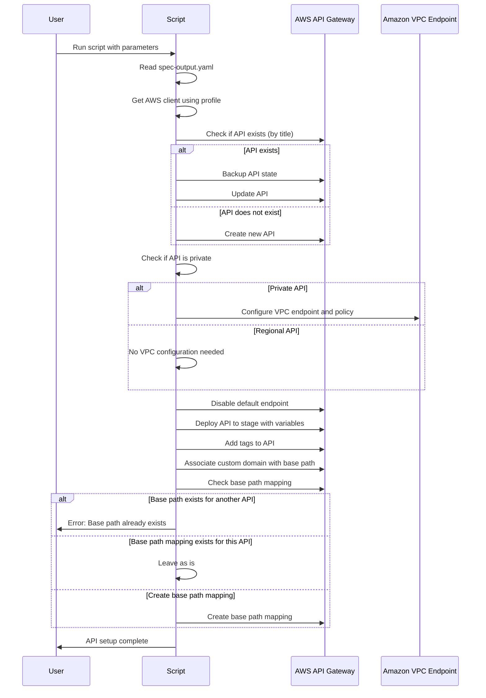

# AWS API Gateway Automation

Este script em Python automatiza a criação e atualização de APIs no AWS API Gateway, utilizando boto3 e seguindo um fluxo definido.

## Pré-requisitos

- Python 3.x
- Biblioteca boto3
- AWS CLI configurado com o perfil adequado

## Uso

```sh
python api_gateway_automation.py <spec_output.yaml> <CustomDomainName> <ProfileName> <TagsNameAPi> <StageVariables> <StageName> <PrivateApi> <VpcEndpoint> [--dry-run]
```

