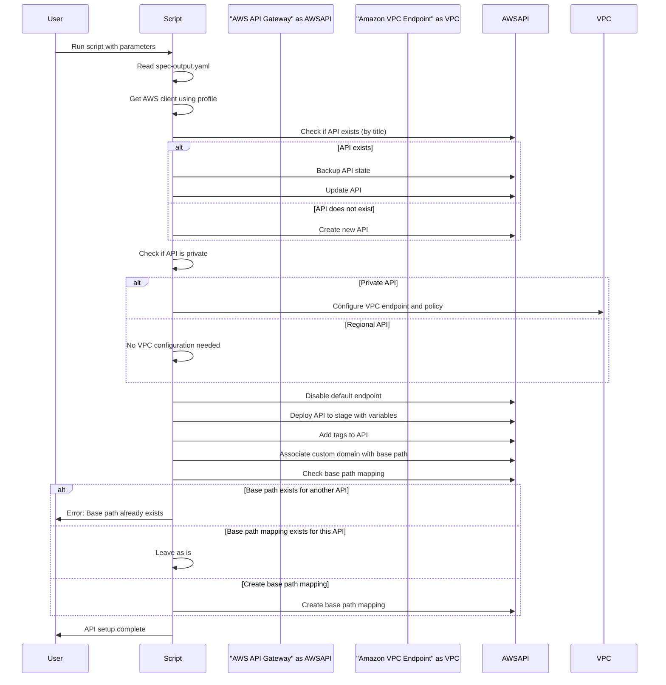
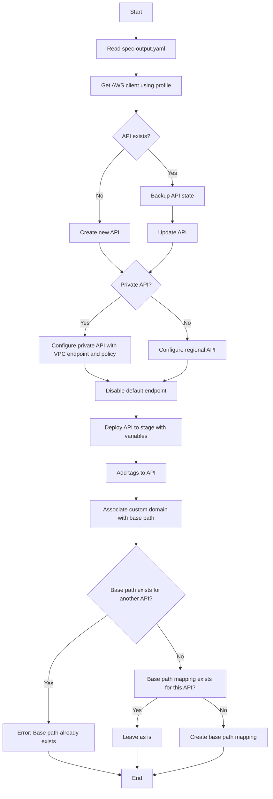
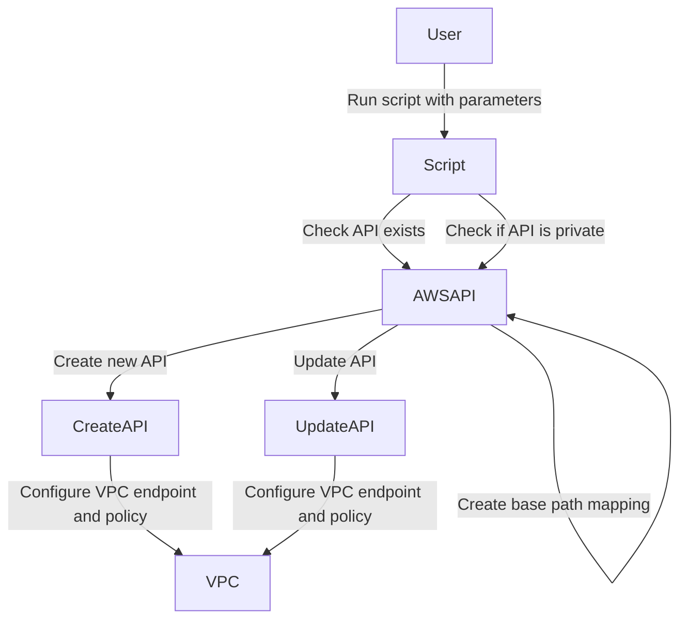

# AWS API Gateway Automation

Este script em Python automatiza a criação e atualização de APIs no AWS API Gateway, utilizando boto3 e seguindo um fluxo definido.

## Pré-requisitos

- Python 3.x
- Biblioteca boto3
- AWS CLI configurado com o perfil adequado

## Uso

```sh
python api_gateway_automation.py <spec_output.yaml> <CustomDomainName> <ProfileName> <TagsNameAPi> <StageVariables> <StageName> <PrivateApi> <VpcEndpoint> [--dry-run]
```

Diagrama de Sequencia


Digrama de Fluxo


Diagrama de Caso de uso


Diagrama de Estado
```mermaid
stateDiagram
    [*] --> Script

    state Script {
        [*] --> CheckAPIExists
        CheckAPIExists --> UpdateAPI : API exists
        CheckAPIExists --> CreateAPI : API does not exist

        state UpdateAPI {
            --> BackupAPIState
            --> UpdateAPI
            --> ConfigureVPC : Private API
            --> DisableEndpoint
            --> DeployAPI
            --> AddTags
            --> AssociateDomain
            --> CheckBasePathMapping
            --> [*]
        }

        state CreateAPI {
            --> CreateAPI
            --> ConfigureVPC : Private API
            --> DisableEndpoint
            --> DeployAPI
            --> AddTags
            --> AssociateDomain
            --> CheckBasePathMapping
            --> [*]
        }

        state ConfigureVPC {
            --> ConfigureVPC
            --> [*]
        }
    }

```

Diagrama de Atividades
```mermaid
journey
    title "Automated API Setup"

    section Setup
        User:
            - Run script with parameters
            - Read spec-output.yaml
            - Get AWS client using profile

    section "Check API"
        Script:
            - Check if API exists (by title)
            - if API exists:
                - Backup API state
                - Update API
            - else:
                - Create new API

    section "Configure API"
        Script:
            - Check if API is private?
                - if Private API:
                    - Configure VPC endpoint and policy
                - else:
                    - No VPC configuration needed

            - Disable default endpoint
            - Deploy API to stage with variables
            - Add tags to API
            - Associate custom domain with base path
            - Check base path mapping

            - if Base path exists for another API:
                - Error: Base path already exists
            - else:
                - if Base path mapping exists for this API:
                    - Leave as is
                - else:
                    - Create base path mapping

            - API setup complete

```

Diagrama de Componentes
```mermaid
graph TD;
    User --> Script;
    Script --> "AWS API Gateway";
    Script --> "Amazon VPC Endpoint";
```